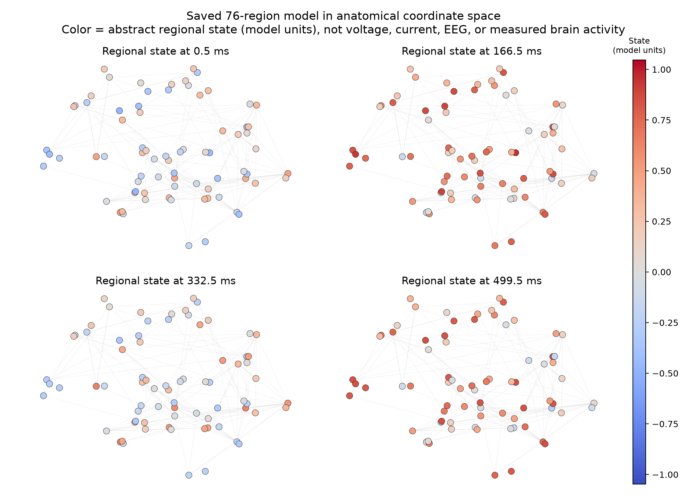
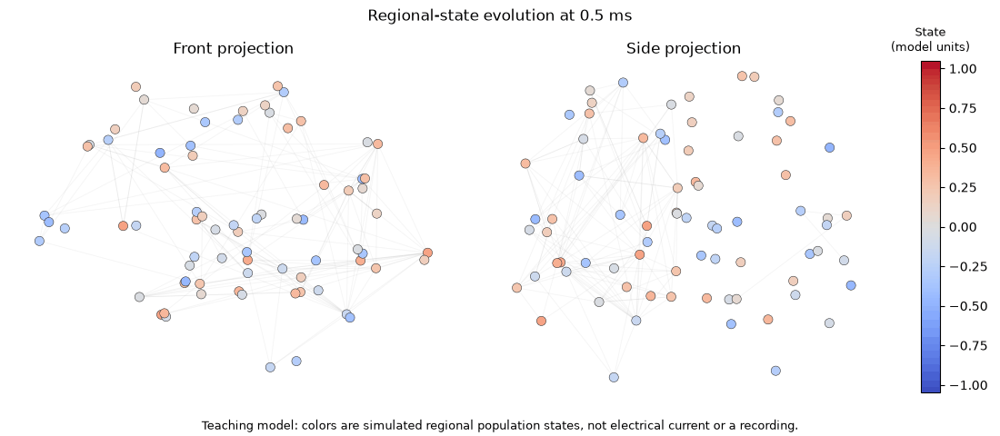
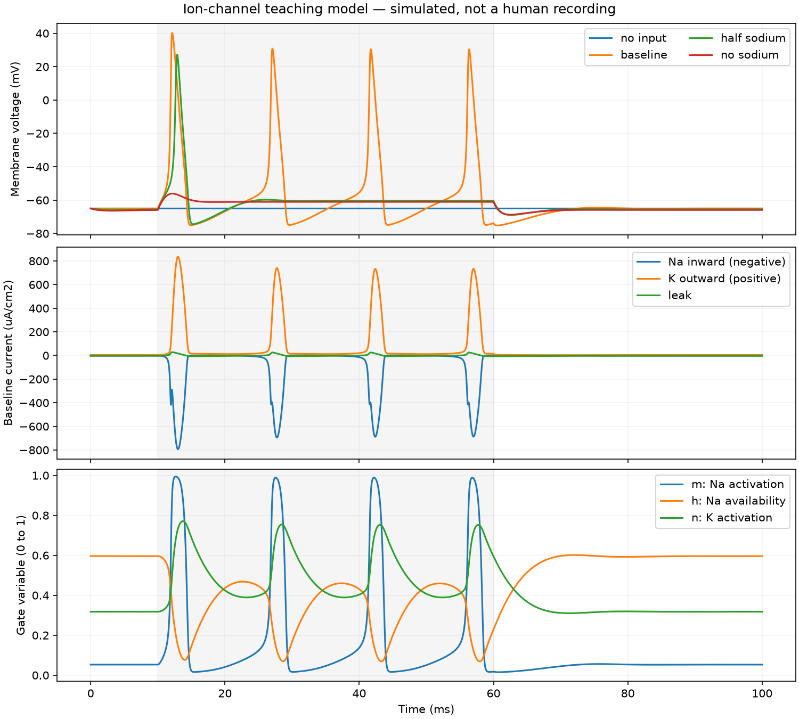
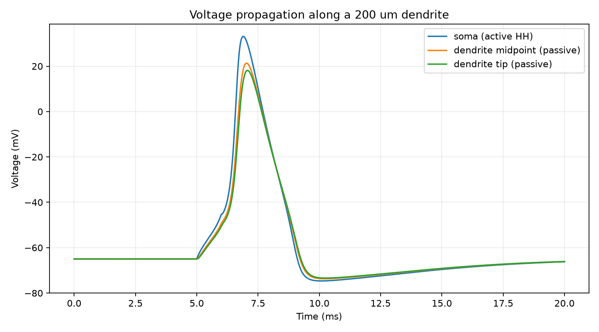
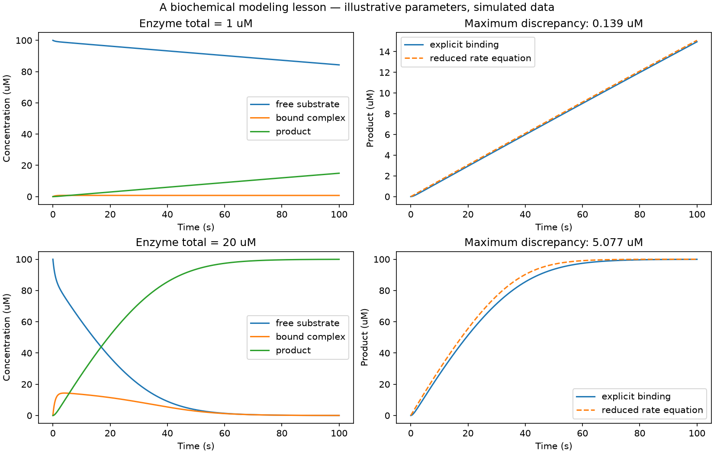
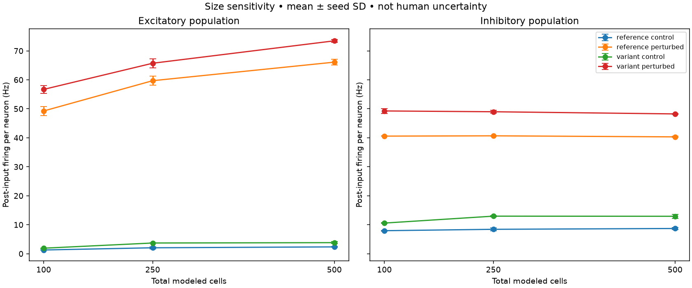

# Neuroscience Modeling Workbench

I am using this repository to learn how computational neuroscience works at
several different scales. I started with a single simplified neuron and kept
building outward: ion channels, dendrites, excitatory/inhibitory circuits,
biochemical reactions, and connected brain regions.

The point is not to make the biggest simulation or claim that I reconstructed
a brain. I want every result to be reproducible, every figure to trace back to
saved numbers, and every limitation to stay beside the result.

This is AI-assisted self-learning work. The simulations are teaching models,
not clinical predictions, patient data, or validated models of PTSD, ketamine,
learning, or consciousness.

## What the regional model looks like



The dots use anatomical coordinates from the bundled TVB connectome. Their
colors show an abstract regional state in model units. They do **not** show
literal electrical current, membrane voltage, EEG, fMRI, or activity measured
from a person.



The animation reads the saved result rather than running a new simulation.
Notebook `07_numbers_to_brain_maps.ipynb` shows exactly how one array row becomes
one animation frame.

## What I can study here

| Lesson | Tool or kernel | Main question |
|---|---|---|
| `01_neuron_and_sql.ipynb` | Brian2, DuckDB | How does input current change firing in a simplified neuron? |
| `02_ketamine_circuit.ipynb` | Brian2, Python | How do selected synaptic assumptions change a small E/I circuit? |
| `03_ion_channels.ipynb` | SciPy | How do sodium and potassium currents create a spike? |
| `04_reaction_networks.ipynb` | Tellurium | When does a reduced reaction equation stop matching explicit binding? |
| `05_brain_regions.ipynb` | The Virtual Brain | How do coupled regional population models differ from uncoupled controls? |
| `06_neuron_compartments.ipynb` | NEURON | How does voltage attenuate from an active soma into a passive dendrite? |
| `07_numbers_to_brain_maps.ipynb` | NumPy, matplotlib | How do arrays and coordinates become an honest brain-region visualization? |

The [study and visualization guide](research/STUDY_AND_VISUALIZATION_GUIDE.md)
is the best starting point if I want to understand and eventually rebuild the
models myself. The [tool guide](research/TOOLS_AND_LESSONS.md) contains the
longer exercises and exact setup commands.

## A few of the saved results

### Ion channels



The baseline produced four spikes, half sodium conductance produced one, and
zero sodium conductance produced none. That nonlinear result belongs to this
illustrative Hodgkin-Huxley setup; it is not a calibrated human neuron.

### Soma and dendrite



The NEURON check produced a 33.16 mV soma peak and an 18.16 mV dendritic-tip
peak. Doubling the dendritic spatial resolution changed the tip trace by at
most 0.034 mV in the fixed test. This verifies the local calculation and its
qualitative attenuation, not a particular biological cell type.

### Reaction networks



The reduced reaction equation stayed close to explicit binding in one regime
and differed visibly in another. The useful result is the boundary of the
approximation, not just a successful solver run.

### Circuit size sensitivity



The measured firing rates were not fully size-independent. Two of sixteen
prespecified comparisons exceeded the descriptive threshold. I kept that
failure because it limits what I can honestly conclude from the smaller model.

## Experiments and evidence

Every new run gets its own directory. Depending on the lesson, it can contain
the configuration, source copy and hash, package versions, raw CSV or NPZ
arrays, metrics, checks, figure, and an interpretation template. New runs do
not overwrite the examples.

- [Experiment index and saved-run format](results/README.md)
- [Circuit experiment](research/EXPERIMENT_001.md)
- [Circuit-size sensitivity](research/EXPERIMENT_002.md)
- [Ion, reaction, and regional foundations](research/EXPERIMENT_003_MULTISCALE.md)
- [NEURON installation and compartment check](research/EXPERIMENT_004_NEURON_COMPARTMENTS.md)
- [Model equations and assumptions](research/MODEL.md)
- [Validation record](research/VALIDATION.md)
- [Evidence review and boundaries](research/REPORT.md)
- [Path from teaching models toward research](research/RESEARCH_PATH.md)

## Reproduce the current work

Use Python 3.13 for the original workbench and Python 3.12 for the Tellurium and
TVB environments. The resolved package receipts are included. Full setup notes,
including the official Windows NEURON installation, are in
[`research/TOOLS_AND_LESSONS.md`](research/TOOLS_AND_LESSONS.md).

```powershell
git clone https://github.com/BlickandMorty/neuron-modeling-workbench.git
cd neuron-modeling-workbench

uv venv --python 3.13 .venv
uv pip install --python .venv\Scripts\python.exe -r requirements-lock.txt
.\.venv\Scripts\python.exe -m unittest -v test_circuit_lab
.\.venv\Scripts\python.exe verify_circuit.py
```

Run the three fixed multiscale lessons with an actual prediction:

```powershell
.\.venv\Scripts\python.exe lessons\run.py channels --prediction "My prediction"
.\.venv-biochem\Scripts\python.exe lessons\run.py reactions --prediction "My prediction"
.\.venv-tvb\Scripts\python.exe lessons\run.py regions --prediction "My prediction"
```

To rebuild the anatomy-aware views from the saved regional arrays:

```powershell
.\.venv\Scripts\python.exe lessons\build_visual_bridge.py
```

## How I am treating ownership

AI assisted with implementation, tests, evidence organization, and early
interpretation. I chose the direction and the standard I want the work held to.
The files show what was run; they do not prove that I can recreate every part
without help.

My real learning test is whether I can start with a blank notebook, explain the
equations and units, make a prediction, change one assumption, design a control,
catch an error, and describe what the result cannot establish. That is why the
study exercises and negative results are part of the repository.
