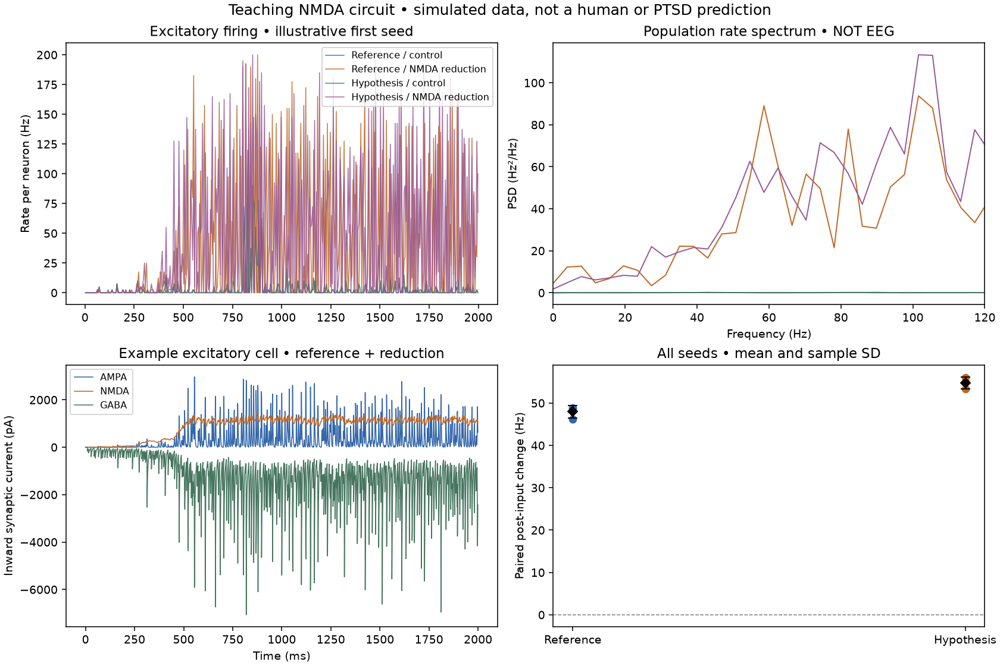

# Experiment 001: cell-targeted NMDA reduction

**Question:** Can a reduction in excitatory synaptic conductance increase collective activity when its effects differ across cell types?

**Method:** 80 E and 20 I cells; reference versus an illustrative 0.85 inhibitory-strength variant; bE=0.10, bI=0.30; a 150 pA pulse to E cells from 800–900 ms; 2000-ms simulations; three paired seeds (11, 22, 33). Fractions and circuit factors are uncalibrated assumptions. Source-linked equations and departure notes are in [MODEL.md](MODEL.md).

**Prediction:** reducing NMDA input to inhibitory cells may disinhibit the network, but recurrent feedback and the reduction on E cells can complicate the direction. The initial CLI run did not record this prediction in its manifest; it must not be described as preregistered. Future notebook runs require a learner prediction before execution.

## Observed result

Post-input E-cell firing (1100–2000 ms), mean across three seeds:

| Condition | Mean firing (Hz per neuron) |
|---|---:|
| Reference, control | 1.292 |
| Reference, NMDA reduction | 49.255 |
| Hypothesis variant, control | 1.907 |
| Hypothesis variant, NMDA reduction | 56.699 |

This is a large regime change in this small network—not a predicted human effect size, PTSD severity or therapeutic benefit. The high-activity condition also emerges without the test pulse. Thus the pulse is **not necessary** for the sustained high-activity state in these tested runs. This weakens an explanation that attributes all sustained activity to the pulse.

Some seeds entered the high-activity regime earlier than others. Pre-pulse averages therefore differ markedly across seeds in one condition; a single trace would conceal that variation. The power spectrum has substantial broad high-frequency activity and does not establish reproduction of a specific human gamma finding.

## Checks and falsifiers

- Twelve standard runs, twelve finer-step runs, and twelve no-pulse runs were retained (36 recorded network simulations).
- dt=0.05 versus 0.1 ms: all eight condition-by-cell-type mean post-input-rate checks met the prespecified engineering tolerance of max(2 Hz, 25% of the coarse mean). Maximum absolute mean-rate difference was 0.3334 Hz.
- These checks do not establish convergence of spectra, individual spikes, transition timing, network-size behavior or the entire response surface.
- Four repeated identity-control configurations (zero NMDA reduction, scale=1) produced identical arrays. This is an expected numerical null, not a biological discovery.
- No favorable-seed selection or post-result parameter tuning was performed. Other parameter regimes may show different effects.

**Boundary:** this system does not contain learning, anatomy, trauma memory, BDNF, autonomic dynamics, pharmacokinetics or clinical symptom outputs. It demonstrates consequences of equations and assumptions, not ketamine's full causal mechanism.

## Reproduce and inspect

- [Standard run](../results/circuit/20260906T032257Z-4791e73e/manifest.json)
- [Finer-step verification](../results/circuit/20260906T032858Z-16826dc0/verification.json)
- [No-pulse control](../results/circuit/20260906T033031Z-7e47e017/manifest.json)

Run `python circuit_lab.py --seeds 11 22 33`, then `python verify_circuit.py`. Newly generated runs have unique paths rather than overwriting these observations.

**Your next task:** predict the effect of equal NMDA reductions on both cell types. Explain which feedback loops motivate your prediction, record it, and run the comparison. Keep a zero or contrary outcome if it occurs.
