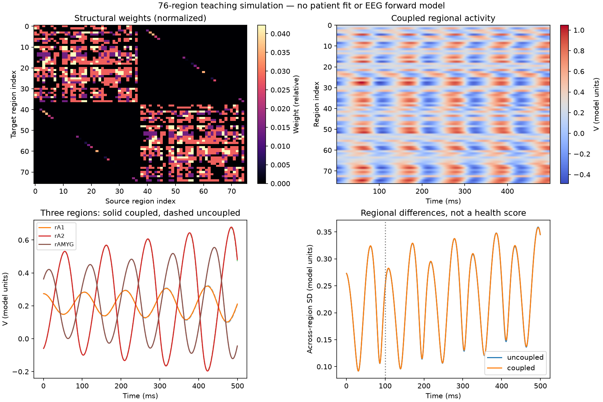

# Three separate neuroscience foundations

Run date: September 6, 2026 local time; filenames use UTC September 7. These are local AI-assisted teaching experiments, not novel clinical findings. Protocols were saved before their runs; they were not externally preregistered and are not Jordan's independently made predictions.

## 1. Ion channels

Question: how does sodium conductance affect spikes in a classical HH membrane?

Method: SciPy DOP853, four conditions, 100 ms total, pulse from 10–60 ms at 10 µA/cm² except the zero-input control. Fixed squid-derived parameters at 6.3°C. One baseline repeated with maximum integration step halved from 0.025 to 0.0125 ms.

Result: no input 0 spikes; full sodium conductance 4; half sodium conductance 1; zero sodium conductance 0. Maximum baseline peak 40.228633 mV. Finer-solver maximum voltage discrepancy 1.006e-8 mV. All seven checks passed. The result demonstrates nonlinear model behavior, not a clinical sodium-blocking intervention.

Evidence: `results/multiscale/20260907T013217Z-ion_channels-6778e803/`. Source is preserved inside the run. The later working-source change adds prediction recording and fixes TVB timing; it does not alter these HH equations.

## 2. Reaction network

Question: when does the reduced Michaelis–Menten product curve differ from the explicit binding model?

Method: fixed synthetic rate constants; enzyme totals 1 and 20 µM with starting substrate 100 µM; 100 seconds. Tellurium/RoadRunner full reaction model compared against an independently written SciPy full model and a reduced equation. Concentration/time units are interpreted consistently in this teaching model, not calibrated to a particular biochemical pathway.

Result: maximum reduced-product discrepancy 0.138630 µM with enzyme 1 µM and 5.076709 µM with enzyme 20 µM. Conservation errors stayed below 4.25e-10 µM; full-model solver differences below 2.42e-7 µM. All six checks passed. The approximation discrepancy is retained, not corrected away. It is not a BDNF or drug simulation.

Evidence: `results/multiscale/20260907T013232Z-reaction_network-df1ab0c1/`.

## 3. Regional brain model

Question: how much does adding weak regional coupling change trajectories in a generic oscillator network?

Method: TVB's bundled 76-region connectome, normalized weights, Generic2dOscillator with a=2, seed-42 constant initial history, coupling 0 versus 0.02, 500 ms simulated time. A deterministic repeat and a finer 0.05 ms integration were compared with the 0.1 ms baseline. Metrics discard the first 100 ms. Exact matrices, starting states, model parameters and traces are saved.

Result: post-transient coupled/uncoupled trajectory RMS difference 0.006400769 model units. Across-region standard deviation averaged 0.236187549 uncoupled versus 0.236842135 coupled: no reduction under this comparison. Repeat maximum error 0; finer-step RMS discrepancy 0.000438620 model units. All five current checks passed. This is one starting history and a weak coupling choice, not evidence for a robust effect across parameter regimes or a diagnosis.

Evidence: `results/multiscale/20260907T013444Z-brain_regions-0b402927/`.

## A development error kept in the record

The first TVB run, `20260907T013242Z-brain_regions-66a0589c`, included the initial-history duration in its displayed time origin. Its intended “discard 100 ms” did not correspond to 100 ms after experimental time zero, and its first averaging window could include unfilled samples. The originally defined checks did not catch this; visual inspection did.

The implementation now resets the clock after setting a constant prehistory and checks that 500 one-ms samples run from 0.5 to 499.5 ms. The corrected run above supersedes the first run for interpretation. The first run and its original checks are preserved, not silently rewritten. This illustrates why passing tests is not enough when the tests omit an important property.

## Boundaries and next actions

Current tutorials: 18 passing in-run checks (7 cell, 6 reaction, 5 corrected regional). These are distinct from the earlier circuit's 22 unit tests. Neither suite establishes validity against biological recordings.

Final release checks: all three new notebooks executed successfully from their assigned fresh kernels in saved-example mode; `.executed.ipynb` copies preserve those outputs. The original circuit's 22 unit tests were rerun and passed in 13.673 seconds. All three final scientific figures were visually inspected. Notebook execution emitted Windows event-loop and local-kernel transport warnings; no remote server was exposed by this work, and the launcher binds JupyterLab to 127.0.0.1. Notebook preview success is not a test of every optional library feature.

At this experiment's original checkpoint, NEURON had only been downloaded and there was no runtime result. That limitation is superseded by [Experiment 004](EXPERIMENT_004_NEURON_COMPARTMENTS.md), which records the later verified installation and compartmental run. Tellurium retains the wheel-tag warnings recorded in [the tool guide](TOOLS_AND_LESSONS.md). TVB surface features are not installed; only the regional simulator was exercised. No money, cloud compute, human data acquisition, GitHub publication or resume updates were involved in these additions.

Next: use notebook 03 to calculate one gate value and explain the four spike counts independently. The [multiscale plan](MULTISCALE_RESEARCH_PLAN.md) separates pending morphology, published-model replication, biochemical evidence and cross-scale validation.
